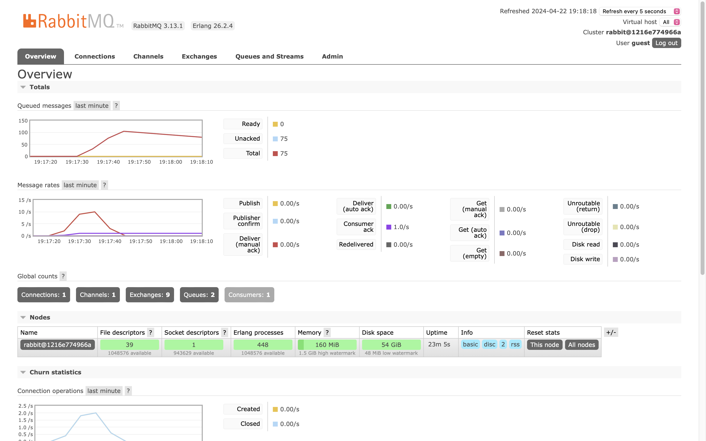
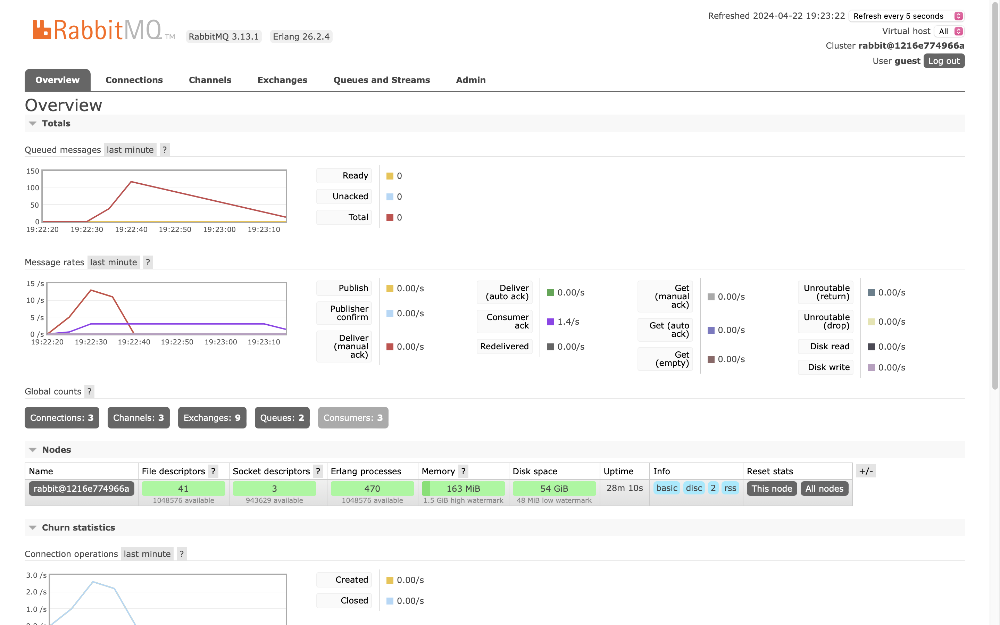

## No 7

a. AMQP stands for Advanced Message Queueing Protocol. Like HTTP, it is an application layer protocol for communication. AMQP defining features are message orientation, queuing, routing (including point-to-point and publish-and-subscribe), reliability, and security. The main difference between AMQP and HTTP is that AMQP is for asychronous data communication, whereas HTTP is for synchronous data communication. AMQP is able to handle the server breakdown issue on its own, whereas HTTP protocol is not. Because of this, AMQP is used for implementing event-driven architecture with RabbitMQ. AMQP is also generally much faster than HTTP.

b. `guest:guest@localhost:5672` means it is accessing `localhost` on port `5672` (the default for RabbitMQ) with user `guest`.

## RabbitMQ one subscriber

## RabbitMQ three subscribers

## Reflection